# Decentralized Motion Planning for Multi-Arm Robot Systems

This project plans motion for a system of several UR5 robot arms that share one workspace. A single **decentralized policy** runs on every arm. Each arm reaches its own target pose using what it observes of the workspace and of the other arms.

The policy is trained with **Soft Actor-Critic (SAC)** reinforcement learning. Expert demonstrations from a sampling-based planner (**BiRRT**) guide the training. Although it was trained only on 1–4 arm static tasks, it generalizes to **5–10 arms** and to **moving targets**, with a success rate above 90%.

The repository also covers the single-arm groundwork: DH kinematics and dynamics modeling of the UR5, and centralized trajectory control in MATLAB.

<p align="center">
  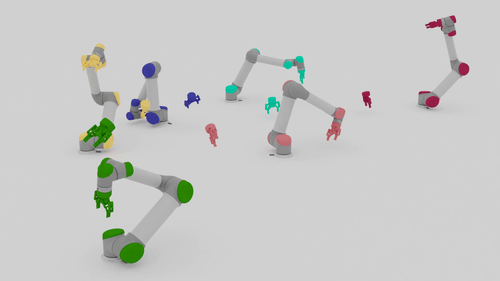
  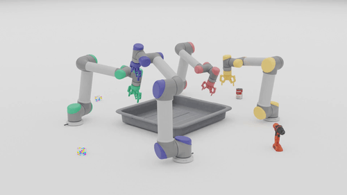
</p>

## Repository layout

```
.
├── MHH-UR5-control/          # UR5 modeling (MATLAB / Maple)
│   ├── DH-DLH.m              #   DH + inertia parameters, forward kinematics & dynamics
│   ├── DHN.m                 #   iterative inverse kinematics (body-frame Newton–Raphson)
│   └── DHT_DLH_RB6DOF_NHT.mw #   Maple worksheet: symbolic DH / dynamics derivation
├── rl-multiarms-model/       # Decentralized multi-arm RL planner (Python, PyBullet)
│   ├── main.py               #   train / benchmark entry point
│   ├── benchmark_dynamic.py  #   benchmark with moving targets
│   ├── summary.py            #   print benchmark scores
│   ├── configs/default.json  #   training hyper-parameters
│   ├── environment/ policy/  #   simulation environment and SAC policy
│   └── demo/                 #   6-DOF bin pick-and-place demo (pretrained checkpoint.pth)
├── Results/                  # GIFs of the trained policy
└── Reports/                  # Full thesis report (PDF / DOCX, in Vietnamese)
```

## 1. UR5 modeling and centralized control (MATLAB)

Requirements: MATLAB with **Robotics System Toolbox**, the **Robotics System Toolbox Support Package for Manipulators**, and **ROS Toolbox** (for Gazebo validation).

- `DH-DLH.m` sets the UR5's DH parameters (`alpha`, `a`, `d`), link masses, centers of mass and inertia tensors. From these it builds the forward kinematics and the Euler–Lagrange dynamic model.
- `DHN.m` solves inverse kinematics iteratively (`IKinBodyIterates`). It starts from an initial joint guess and runs until the end-effector twist error falls within `eomg` / `ev`.
- `DHT_DLH_RB6DOF_NHT.mw` holds the symbolic derivation in Maple. It checks the end-effector coordinates computed in MATLAB.

Run the scripts from inside `MHH-UR5-control/` in MATLAB. Report Chapter 3 describes the centralized control workflow:

1. Load the UR5 `RigidBodyTree` (`loadrobot`) and attach the gripper (`addBody`).
2. Pick waypoints on the workpiece with the mouse. Set each waypoint's orientation with the keyboard: **↑/↓** rotate about X, **←/→** rotate about Y, **C** saves the orientation, **N** moves to the next waypoint (or skips it if nothing was saved).
3. Build the task-space trajectory. `transformtraj` interpolates poses at constant TCP speed, `inverseKinematics` solves for joint angles at each point, and `minjerkpolytraj` produces joint velocities and accelerations.
4. Play back the trajectory and plot joint angles, velocities, accelerations and the re-computation errors.

## 2. Decentralized multi-arm planner (Python)

### Setup

Python 3.7, PyTorch 1.6.0, pybullet, numpy, numpy-quaternion, ray, tensorboardX.

```sh
cd rl-multiarms-model
conda env create -f environment.yml
conda activate multiarm
```

### Evaluate the pretrained planner

```sh
# pretrained weights + benchmark task set
wget -qO- https://multiarm.cs.columbia.edu/downloads/checkpoints/ours.tar.xz | tar xvfJ -
wget -qO- https://multiarm.cs.columbia.edu/downloads/data/benchmark.tar.xz | tar xvfJ -

# static targets (drop --gui to run headless; raise --num_processes to use more CPUs)
python main.py --mode benchmark --tasks_path benchmark/ --load ours/ours.pth --num_processes 1 --gui

# print the score summary
python summary.py ours/benchmark_score.pkl

# moving (dynamic) targets
python benchmark_dynamic.py --mode benchmark --tasks_path benchmark/ --load ours/ours.pth --num_processes 1 --gui
```

### Train from scratch

```sh
# training tasks + BiRRT expert demonstrations
wget -qO- https://multiarm.cs.columbia.edu/downloads/data/tasks.tar.xz | tar xvfJ -
wget -qO- https://multiarm.cs.columbia.edu/downloads/data/expert.tar.xz | tar xvfJ -

mkdir runs
python main.py --config configs/default.json --tasks_path tasks/ \
    --expert_waypoints expert/ --num_processes 16 --name multiarm_motion_planner
```

`main.py` also accepts `--curriculum_level` and `--expert_trajectories`. Hyper-parameters live in `configs/default.json`. Logs go to `runs/` and can be viewed with TensorBoard.

### Pick-and-place demo

```sh
cd rl-multiarms-model/demo
wget -qO- https://multiarm.cs.columbia.edu/downloads/data/benchmark.tar.xz | tar xvfJ -
mv benchmark tasks/

python demo.py                                            # runs 500 trials
python evaluate_results.py --result_dir path/to/results/dir
```

The demo uses the bundled `checkpoint.pth`. `evaluate_results.py` reports `success_rate`, `avg_steps` and counts of plane collisions, robot collisions and timeouts. To render a run in Blender, import the saved simulation file with the [PyBullet Blender recorder](https://github.com/huy-ha/pybullet-blender-recorder).

## 3. Results

### Evaluation setup

- **Success:** at some timestep, *every* arm is within **2 cm** and **0.1 rad** of its target pose. The task fails on any collision or after 500 timesteps.
- **Difficulty:** the maximum overlap between one arm's hemispherical workspace and those of all other arms. Easy is 0–0.35, medium 0.35–0.45, hard 0.45–0.50. Dynamic tasks are graded by target speed: slow 1–5, medium 5–10, fast 10–15 cm/s.
- **Test set:** 30,000 unseen tasks spread evenly over 1–10 arms.
- **Training:** 668.2M timesteps (~14 days, ~700k episodes) on an Intel i7-7820X with a GTX 1080. Generating 1M BiRRT expert waypoints took 2 days.

### Scalability and speed

One forward pass of the policy takes **1.09 ms (~920 Hz)** on a single CPU thread, and this time does not grow with the number of arms. Total planning time grows linearly with team size. Centralized BiRRT grows exponentially, and on 10-arm tasks the policy is about **15× faster**.

### Success rate vs. number of arms (static targets)

The policy was trained on 1–4 arms only. The 5–10 arm rows test generalization to larger teams.

| Arms | Easy  | Medium | Hard  | Average |
|:----:|:-----:|:------:|:-----:|:-------:|
| 1    | 0.986 | –      | –     | 0.986   |
| 2    | 0.958 | 0.904  | 0.876 | 0.943   |
| 3    | 0.969 | 0.945  | 0.915 | 0.960   |
| 4    | 0.956 | 0.937  | 0.937 | 0.951   |
| 5    | 0.948 | 0.935  | 0.914 | 0.943   |
| 6    | 0.947 | 0.915  | 0.900 | 0.938   |
| 7    | 0.924 | 0.901  | 0.894 | 0.918   |
| 8    | 0.909 | 0.907  | 0.920 | 0.910   |
| 9    | 0.912 | 0.928  | 0.864 | 0.910   |
| 10   | 0.908 | 0.904  | 0.881 | 0.905   |

Success drops a little as the team grows, mostly because of how success is defined. All N arms must succeed, so if one arm succeeds with probability *p*, the team succeeds with roughly *p*ᴺ.

| 2 arms | 3 arms (hard) | 4 arms (medium) |
|:--:|:--:|:--:|
| 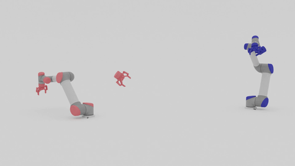 | 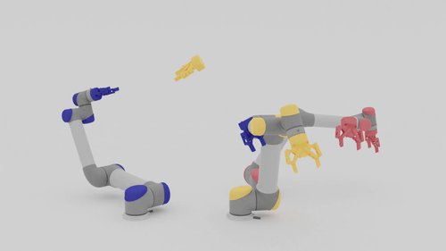 | 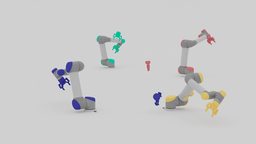 |
| **6 arms (medium)** | **7 arms (easy)** | **8 arms (hard)** |
|  | 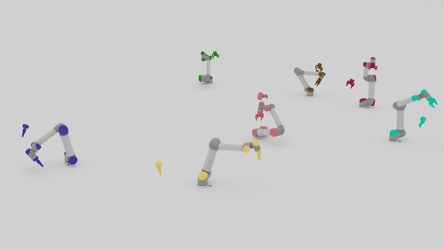 | 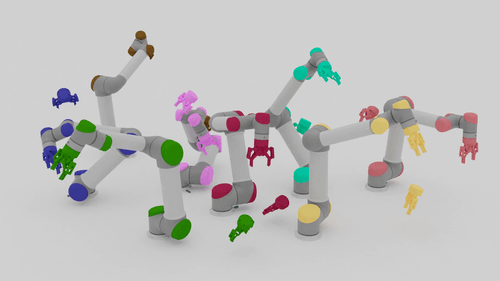 |

### Comparison with baselines

| Method \ arms                           | 1     | 2     | 3     | 4     |
|-----------------------------------------|:-----:|:-----:|:-----:|:-----:|
| No expert demonstrations                | 0.001 | 0.000 | 0.000 | 0.000 |
| Behavior cloning (no RL)                | 0.403 | 0.685 | 0.646 | 0.852 |
| Selfish (individual reward only)        | 0.139 | 0.001 | 0.000 | 0.000 |
| Individualistic (can't see other arms)  | 0.224 | 0.023 | 0.000 | 0.000 |
| **Ours**                                | **0.988** | **0.943** | **0.960** | **0.951** |

- **No demonstrations:** the agent almost never earns a reward and learns to stand still to avoid collision penalties.
- **Selfish / Individualistic:** with no team reward, or no view of the other arms, the arms don't coordinate and collide.
- **Behavior cloning:** copies the expert but breaks down in states the demonstrations don't cover. Our policy goes beyond the expert data through RL exploration and also finishes tasks faster.

| Behavior cloning | Individualistic | Selfish | Ours |
|:--:|:--:|:--:|:--:|
| 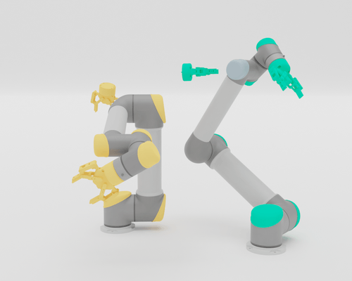 | 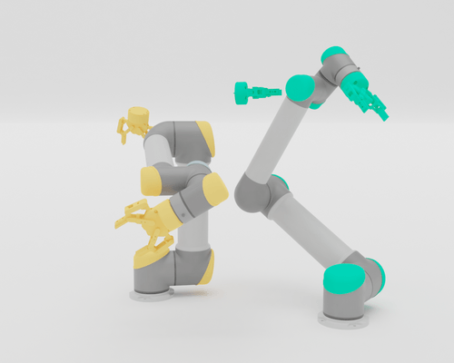 | 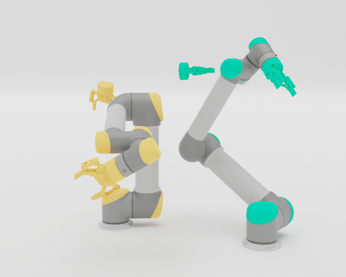 | 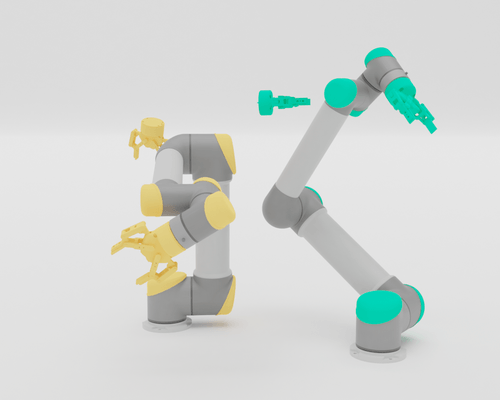 |

### Pick-and-place

| | | | |
|:--:|:--:|:--:|:--:|
| 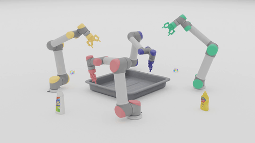 |  | 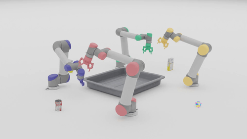 | 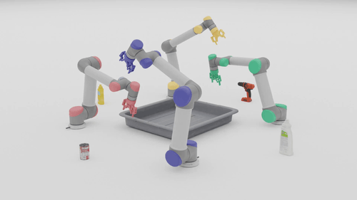 |

## Report

The full write-up (in Vietnamese) is in [`Reports/BaoCaoTongHopPDF.pdf`](Reports/BaoCaoTongHopPDF.pdf). It covers UR5 DH and dynamics modeling (Ch. 2), centralized control (Ch. 3), multi-arm RL motion planning (Ch. 4) and results (Ch. 5).

## Acknowledgements

The multi-arm RL code, pretrained checkpoint and datasets build on *Learning a Decentralized Multi-arm Motion Planner* (Ha, Xu & Song, CoRL 2020) from Columbia University: <https://multiarm.cs.columbia.edu>.
